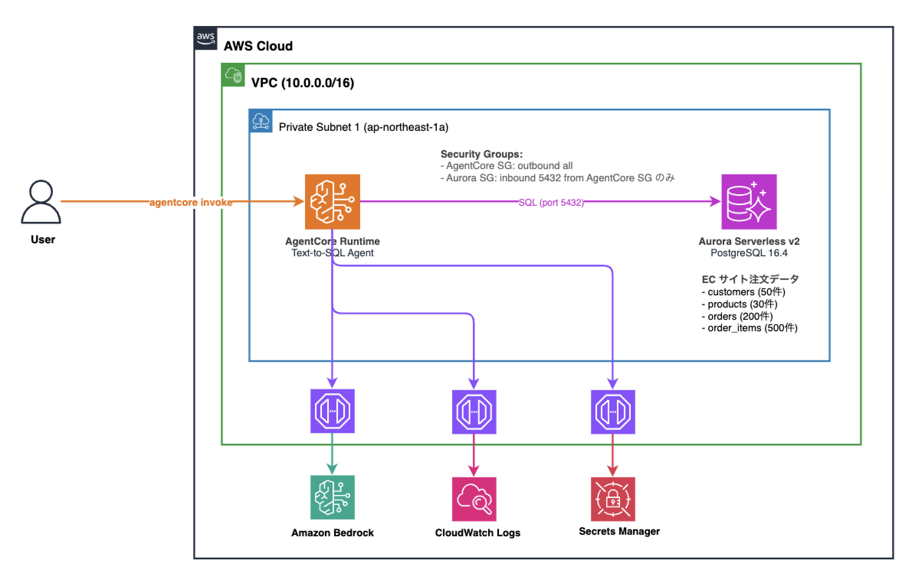

# AgentCore VPC Text-to-SQL

AgentCore を VPC に入れて Aurora Serverless v2 に自然言語で問い合わせる Text-to-SQL エージェントです。

## アーキテクチャ



## 前提条件

- AWS CLI v2（認証設定済み）
- Node.js 18 以上
- pnpm
- Python 3.10 以上
- AgentCore CLI (`pip install bedrock-agentcore`)
- CDK Bootstrap 済み (`pnpm exec cdk bootstrap aws://ACCOUNT_ID/ap-northeast-1`)

## 手順

### Step 1. CDK デプロイ（インフラ構築）

```bash
cd cdk
pnpm install
pnpm exec cdk deploy
```

デプロイ完了後、Outputs を控えておきます（後続の手順で使用）:

```
text-to-sql-stack.VpcId = vpc-xxxxxxxxx
text-to-sql-stack.SubnetIds = subnet-aaa,subnet-bbb
text-to-sql-stack.AgentCoreSecurityGroupId = sg-xxxxxxxxx
text-to-sql-stack.ClusterArn = arn:aws:rds:...
text-to-sql-stack.SecretArn = arn:aws:secretsmanager:...
text-to-sql-stack.ClusterEndpoint = text-to-sql-stack-auroracluster-xxx...
text-to-sql-stack.DatabaseName = ecommerce
```

### Step 2. サンプルデータの投入

```bash
cd cdk
chmod +x scripts/seed-data.sh
./scripts/seed-data.sh
```

投入されるデータ:

| テーブル | 件数 | 内容 |
|:---------|:-----|:-----|
| customers | 50 | 顧客（名前・メール・都道府県） |
| products | 30 | 商品（電子機器・衣類・食品・書籍・日用品） |
| orders | 200 | 注文（過去 90 日分） |
| order_items | 500 | 注文明細 |

### Step 3. AgentCore プロジェクトの作成

```bash
cd agent
agentcore create \
  --name texttosql \
  --framework Strands \
  --model-provider Bedrock \
  --memory none \
  --network-mode VPC \
  --subnets "（SubnetIds の値1）,（SubnetIds の値2）" \
  --security-groups "（AgentCoreSecurityGroupId の値）" \
  --skip-python-setup
```

> **注意**: プロジェクト名にハイフン (`-`) やアンダースコア (`_`) は使えません。英数字のみ、23文字以内です。

### Step 4. AgentCore デプロイ

`agent/texttosql/agentcore/agentcore.json` の runtime の `envVars` に環境変数を追加します:

```json
"envVars": [
  {
    "name": "DB_SECRET_ARN",
    "value": "（SecretArn の値）"
  },
  {
    "name": "DB_NAME",
    "value": "ecommerce"
  }
]
```

その後デプロイします:

```bash
cd agent/texttosql
agentcore deploy
```

### Step 5. 実行ロールに Secrets Manager の権限を追加

`agentcore deploy` で自動作成される実行ロールには Secrets Manager へのアクセス権限が含まれていないため、手動で追加します。

```bash
# 実行ロール名は agentcore deploy の出力、または .bedrock_agentcore.yaml の
# aws.execution_role から確認できます
ROLE_NAME="（実行ロール名）"
SECRET_ARN="（SecretArn の値）"

aws iam put-role-policy \
  --role-name "$ROLE_NAME" \
  --policy-name "SecretsManagerReadAccess" \
  --policy-document '{
    "Version": "2012-10-17",
    "Statement": [{
      "Effect": "Allow",
      "Action": "secretsmanager:GetSecretValue",
      "Resource": "'"$SECRET_ARN"'*"
    }]
  }'
```

### Step 6. 動作確認

エンドポイントが READY になるまで待ちます:

```bash
agentcore status
# Endpoint: DEFAULT (READY) になるまで待つ
```

invoke で動作確認:

```bash
# テーブル一覧
agentcore invoke '{"prompt": "テーブル一覧を教えて"}'

# 売上クエリ
agentcore invoke '{"prompt": "売上トップ5の商品は？"}'

# 都道府県別の顧客数
agentcore invoke '{"prompt": "都道府県別の顧客数を教えて"}'
```

## クリーンアップ

**検証後は必ず実行してください。** 放置すると VPC Endpoint の課金（~$1/日）が発生します。

```bash
cd agent/texttosql
agentcore destroy

# ENI が解放されるまで待機（数分〜数時間）

cd cdk
npx cdk destroy
```

> **注意**: AgentCore が VPC 内に作成した ENI の解放に数分〜数時間かかることがあります。
> ENI が残っている間は Security Group を削除できないため、`cdk destroy` が失敗します。
> 待ちきれない場合は `aws cloudformation delete-stack --stack-name text-to-sql-stack --deletion-mode FORCE_DELETE_STACK --region ap-northeast-1` で強制削除できます。
